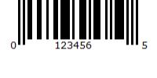

# Html5-Barcode 
## Description

This is a cross-platform JavaScript library to integrate QR code, bar codes & a few other types of code scanning capabilities to your applications running on HTML5 compatible browser.

It mainly created to increase efficiency of logistics process.
-   Supports easy scanning using an integrated webcam or camera in smartphones (Android / IOS).

-   Supports scanning codes from files or default cameras on smartphones.

-   **<u>Recently Added</u>** Supports bar code scanning in various formats.
-    Supports two kinds of APIs
    -   `Html5QrcodeScanner` — End-to-end scanner with UI, integrate with less than ten lines of code.
    -   `Html5Qrcode` — Powerful set of APIs you can use to build your UI without worrying about camera setup, handling permissions, reading codes, etc.

  ### Supported Code formats
Code scanning is dependent on [Zxing-js](https://github.com/zxing-js/library) library. We will be working on top of it to add support for more types of code scanning. If you feel a certain type of code would be helpful to have, please file a feature request.

| Code | Example |
| ---- | ----- |
| QR Code |  |
| AZTEC |  |
| CODE_39|   |
| CODE_93| |
| CODE_128| |
| ITF| |
| EAN_13| |
| EAN_8| |
| PDF_417| |
| UPC_A| |
| UPC_E| |
| DATA_MATRIX| |
| MAXICODE*|  |

Download the script from release page or install using npm with:

npm i html5-qrcode
Add an element you want to use as a placeholder for QR Code scanner

Ideally do not set the height of this container as the height should depend on the height of the video feed from the camera. The library would honor the existing width, otherwise apply the default width. The height is derived from the aspect ratio of the video feed.

### `npm start`

Runs the app in the development mode.\
Open [http://localhost:3000](http://localhost:3000) to view it in your browser.

The page will reload when you make changes.\
You may also see any lint errors in the console.

## Learn More

You can learn more in the [Create React App documentation](https://facebook.github.io/create-react-app/docs/getting-started).

To learn React, check out the [React documentation](https://reactjs.org/).

